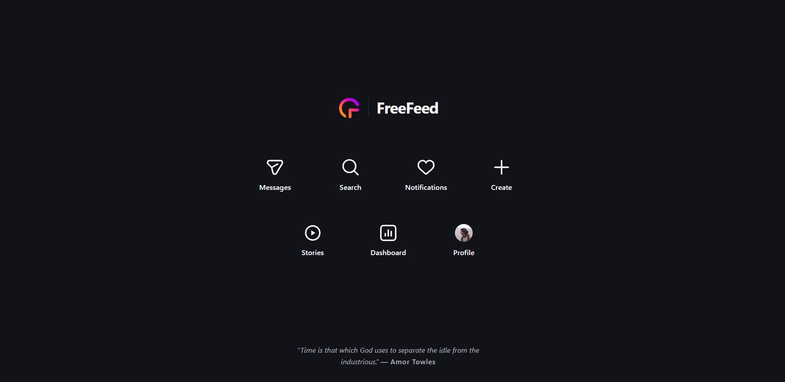

# FreeFeed


FreeFeed is a small Chrome extension that replaces Instagram's home page with a few useful shortcuts. Messages, search, notifications, posting, Stories, and your profile stay within reach. Feed and Reels are blocked by default.

Open Instagram, do what you came for, get on with your day.



## What stays, what goes

You choose which activities remain available in **Settings**.

| Activity | Default |
| --- | --- |
| Feed | Blocked |
| Reels | Blocked |
| Messages | Available |
| Search and Explore | Available |
| Notifications | Available |
| Create | Available |
| Stories | Available |

Your profile stays accessible. If Instagram provides a professional dashboard for your account, FreeFeed includes a shortcut to it too.

Turning an activity off takes effect immediately. Turning one back on takes a little more intention: wait 10 seconds, acknowledge the change, and type its confirmation phrase, such as `ENABLE REELS`.

Need normal Instagram for a minute? Open the extension popup and choose **2, 5, or 15 minutes** of temporary access. It applies across your open Instagram tabs, then your restrictions resume automatically. You can also end it early with **Lock Instagram now**.

## Install

Install from the Chrome Webstore : [FreeFeed](https://chromewebstore.google.com/detail/freefeed-instagram-reels/ibacnnffpajhcpcicodpaakibknepnmm?authuser=0&hl=en)

---
(Or, manually -)
Requires desktop Chrome 105 or newer. FreeFeed works on `https://www.instagram.com/`; it doesn't change the Instagram mobile app.

1. [Download the repository](https://github.com/ronanrocking/FreeFeed/archive/refs/heads/main.zip) and extract it, or clone it:

   ```sh
   git clone https://github.com/ronanrocking/FreeFeed.git
   ```

2. Open `chrome://extensions` and enable **Developer mode**.
3. Click **Load unpacked** and select the `extension` folder inside the repository.
4. Open Instagram and refresh any tabs that were already open.

The welcome page opens on your first install. Pin FreeFeed from Chrome's Extensions menu for easy access to the timer and settings.

## Privacy

FreeFeed runs in your browser. Activity choices and the temporary-access deadline stay in Chrome's local extension storage. There's no FreeFeed account, analytics, telemetry, or developer server.

The extension reads Instagram's page address and the interface elements it needs to hide or open features. It doesn't save or transmit your messages, feed content, searches, or credentials. Instagram still handles your activity under its own privacy practices.

The manifest requests `storage` to remember your choices and `alarms` to end temporary access. Its content script runs only on `https://www.instagram.com/*`.

Read the [bundled privacy policy](extension/privacy.html) or the [public policy source](public/privacy.html).

## Working on FreeFeed

Plain JavaScript, HTML, and CSS. Manifest V3. No dependencies, package install, or build step.

```text
extension/          The complete, loadable extension
  content.js        Instagram dashboard and interface restrictions
  settings.js       Defaults, route rules, and confirmation helpers
  background.js     Temporary-access alarm and first-install welcome
  popup.*           Temporary access and About
  options.*         Activity settings
  welcome.*         First-install page
  assets/           Icons and images
tests/              Tests using Node's built-in test runner
public/             Public privacy policy for GitHub Pages
```

With Node.js installed, run from the repository root:

```sh
node --test
```

After editing, click **Reload** on FreeFeed's card at `chrome://extensions`, then refresh Instagram. Check the home page, DMs, login, blocked Reels URLs, and temporary-access expiry in the browser; the automated tests don't replace that check.

## Packaging and publishing

The extension ships directly from `extension/`. Update the version in `extension/manifest.json`, run the tests, and zip **the contents** of that folder. `manifest.json` must be at the ZIP root.

From the repository root in PowerShell:

```powershell
$version = (Get-Content extension/manifest.json -Raw | ConvertFrom-Json).version
Compress-Archive -Path extension/* -DestinationPath "FreeFeed-$version.zip"
```

Use a new version for each release. Upload that ZIP to the Chrome Web Store developer dashboard; store publication is a separate step from loading the extension locally.

The existing [Pages workflow](.github/workflows/deploy-public-pages.yml) publishes only `public/`. To host the privacy policy, set the repository's **Settings → Pages → Source** to **GitHub Actions**, then run **Deploy public policy**, or push a change to `public/` on `main`. Once deployed, verify `https://ronanrocking.github.io/FreeFeed/privacy.html` opens publicly before using it in the store listing.

## Bugs and suggestions

Instagram changes its interface often. If a shortcut disappears or a restriction stops working, reload the extension and refresh Instagram first. If it still happens, [open an issue](https://github.com/ronanrocking/FreeFeed/issues) with the route, Chrome version, FreeFeed version, and steps to reproduce it. Keep private messages and account details out of screenshots.

Built by [Ronan](https://github.com/ronanrocking). You can also reach me at [ronanrocking@gmail.com](mailto:ronanrocking@gmail.com).

FreeFeed is an independent project and isn't affiliated with Instagram or Meta.
